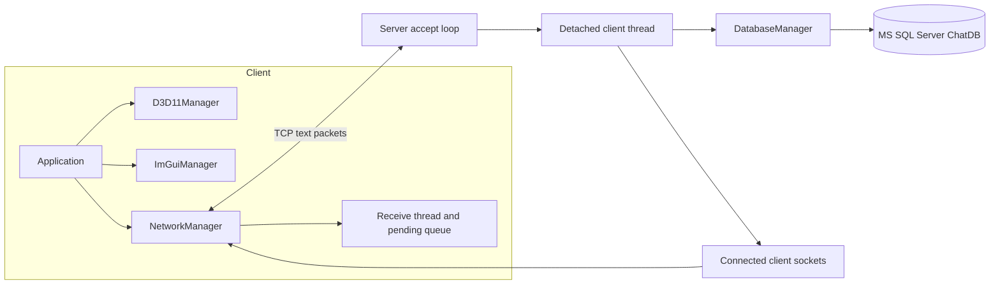

# ChattingServerDemo

Windows 환경에서 TCP 채팅의 클라이언트, 서버, 데이터베이스 연결을 한 저장소에 구현한 개인 데모입니다. 클라이언트는 Direct3D 11과 ImGui로 화면을 그리고, 서버는 Winsock으로 여러 연결을 받아 MS SQL Server에 사용자와 채팅 기록을 저장하도록 구성했습니다.

## 현재 확인된 범위

- Client와 Server의 x64 Debug 빌드가 Visual Studio 2022에서 완료됩니다.
- Server는 8888 포트에서 수신을 시작한 뒤 로컬 `ChatDB` 연결을 시도합니다.
- 현재 검증 환경에는 해당 SQL Server 인스턴스가 없어 ODBC 오류 `08001`로 종료됩니다.
- 저장소에는 자동화된 테스트가 없습니다.
- 회원가입, 로그인, 채팅의 전체 흐름은 데이터베이스가 준비된 환경에서 추가 검증이 필요합니다.

구현된 코드와 실제로 확인한 동작을 구분하기 위해, 아직 끝까지 검증하지 못한 기능을 완료된 서비스처럼 적지 않았습니다.

## 전체 구조



클래스 소유 관계, 스레드 경계, 패킷 형식, 데이터 모델은 [아키텍처 문서](docs/architecture.md)에 정리했습니다.

## 구현 흐름

### 회원가입과 로그인

클라이언트가 닉네임과 비밀번호를 공백으로 구분한 텍스트 패킷으로 보냅니다. 서버의 클라이언트 스레드는 패킷 종류에 따라 `RegisterUser` 또는 `ValidateUser`를 호출하고 성공 또는 실패 패킷을 돌려줍니다.

현재 로그인 화면은 비밀번호 입력란 없이 빈 비밀번호를 보냅니다. 회원가입에서 비밀번호를 저장하는 구조와 맞지 않으므로, 등록한 계정으로 로그인하는 흐름은 그대로는 성립하지 않습니다.

### 채팅

서버는 받은 채팅을 `ChatLogs`에 기록한 뒤 발신자를 제외한 연결에 브로드캐스트합니다. 클라이언트의 수신 스레드는 받은 패킷을 mutex로 보호된 큐에 넣고, UI 스레드가 매 프레임 큐를 비워 채팅 로그에 추가합니다.

발신 클라이언트는 자신의 메시지를 로컬 로그에 추가하지 않고 서버도 발신자에게 되돌려주지 않습니다. 따라서 현재 코드에서는 내가 보낸 메시지가 내 화면에 나타나지 않습니다.

## 빌드

필요한 환경은 Windows 10 이상, Visual Studio 2022 C++ 데스크톱 워크로드, Windows SDK, DirectX 11 지원 GPU입니다. 서버를 끝까지 실행하려면 SQL Server와 ODBC 드라이버도 필요합니다.

두 프로젝트는 Visual Studio 2019의 `v142` 도구 집합을 지정합니다. 현재 Visual Studio 2022에서는 프로젝트 파일을 수정하지 않고 `v143`으로 빌드했습니다.

```powershell
& 'C:\Program Files\Microsoft Visual Studio\2022\Community\MSBuild\Current\Bin\MSBuild.exe' `
  Client\Client.sln /m /p:Configuration=Debug /p:Platform=x64 /p:PlatformToolset=v143

& 'C:\Program Files\Microsoft Visual Studio\2022\Community\MSBuild\Current\Bin\MSBuild.exe' `
  Server\Server.sln /m /p:Configuration=Debug /p:Platform=x64 /p:PlatformToolset=v143
```

생성되는 실행 파일은 다음과 같습니다.

- `Client/x64/Debug/Client.exe`
- `Server/x64/Debug/Server.exe`

## 데이터베이스 준비

[Server/ChatDB.sql](Server/ChatDB.sql)은 `ChatDB`, `Users`, `ChatLogs`를 만듭니다. 서버의 연결 문자열은 다음 로컬 Windows 인증 구성을 고정해 사용합니다.

```text
DRIVER={SQL Server};SERVER=localhost;DATABASE=ChatDB;Trusted_Connection=yes;
```

SQL Server에서 스크립트를 먼저 실행한 뒤 서버 프로세스 계정에 데이터베이스 권한을 부여해야 합니다. 연결 문자열을 설정 파일이나 환경 변수로 분리한 상태는 아닙니다.

## 실행 순서

1. SQL Server에 `Server/ChatDB.sql`을 적용합니다.
2. `Server/x64/Debug/Server.exe`를 실행하고 포트를 입력합니다. 빈 입력은 8888을 사용합니다.
3. `Client/x64/Debug/Client.exe`를 실행하고 서버 IP와 포트를 입력합니다.
4. ImGui 로그인 창에서 회원가입 또는 로그인을 시도합니다.

## 코드 지도

| 경로 | 역할 |
| --- | --- |
| `Common/PacketDefine.h` | 클라이언트와 서버가 공유하는 패킷 종류와 채팅 데이터 |
| `Client/Core/main.cpp` | 서버 주소 입력과 클라이언트 수명 관리 |
| `Client/UI/Application.*` | Win32 창, 로그인 및 채팅 화면, 프레임 루프 |
| `Client/UI/D3D11Manager.*` | Direct3D 디바이스, 스왑 체인, 렌더 타깃 |
| `Client/Core/ImGuiManager.*` | ImGui의 Win32 및 DX11 백엔드 수명 |
| `Client/Network/NetworkManager.*` | 연결, 송신, 수신 스레드, UI 전달 큐 |
| `Server/Core/Server.*` | 수신 소켓, 연결별 스레드, 패킷 분기와 브로드캐스트 |
| `Server/Database/DatabaseManager.*` | ODBC 연결과 사용자 및 채팅 SQL |
| `Server/Network/Session.h` | 소켓 세션 인터페이스 초안, 현재 서버 경로에서는 미사용 |
| `Server/ChatDB.sql` | 사용자와 채팅 로그 스키마 |

## 현재 한계와 보안 경계

- 비밀번호를 평문으로 송신하고 데이터베이스에도 평문으로 저장합니다. 외부 서비스에 사용할 수 없는 데모 구현입니다.
- TCP 스트림에 길이 헤더나 구분 프레임이 없습니다. 한 번의 `recv`가 패킷 하나와 정확히 같다고 가정해 분할 또는 합쳐진 패킷을 처리하지 못합니다.
- 서버가 분리한 클라이언트 스레드들이 `connectedClients`와 하나의 DB 연결을 동기화 없이 공유합니다.
- `Session` 클래스는 선언만 있고 현재 실행 경로에 연결되지 않습니다.
- `GetChatHistory`는 구현돼 있지만 클라이언트가 기록을 요청하는 패킷과 화면은 없습니다.
- 로그인 비밀번호, 발신 메시지 표시, 회원가입 성공과 로그인 성공의 구분이 완성되지 않았습니다.

빌드와 실행 결과는 [검증 기록](docs/verification.md)에서 확인할 수 있습니다.

## 작업 범위

Git 기록의 19개 커밋은 동일 작성자의 두 Git 계정 표기로 남아 있습니다. 클라이언트 UI와 렌더링, Winsock 통신, 서버 패킷 분기, ODBC 데이터 접근, SQL 스키마를 한 프로젝트 안에서 구현했습니다.
