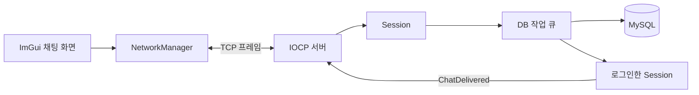

# Chatting Server Demo

Windows 소켓과 IOCP를 공부하며 만든 실시간 채팅 서비스입니다. Direct3D 11 클라이언트에서 계정을 만들고 대화할 수 있으며, 메시지는 MySQL에 저장되어 다시 접속해도 최근 기록을 불러옵니다.

`C++17` `Winsock2` `IOCP` `Direct3D 11` `Dear ImGui` `MySQL` `ODBC` `Docker Compose`

[](docs/assets/chat-service-demo.mp4)

두 클라이언트가 주고받은 메시지가 아래 서버를 거쳐 MySQL에 저장되는 과정을 한 화면에 담았습니다. [18초 시연 영상 보기](docs/assets/chat-service-demo.mp4)

## 주요 기능

- 계정 생성과 로그인
- 여러 클라이언트의 실시간 채팅
- MySQL 메시지 저장과 최근 50개 복원
- 날짜 구분선, 전송 시각, 내 메시지와 상대 메시지 구분

## 구조



클라이언트 화면은 소켓을 직접 다루지 않습니다. `NetworkManager`가 연결과 송수신을 맡고, 서버는 IOCP로 여러 연결의 완료 이벤트를 처리합니다. DB 조회와 저장은 별도 작업 큐에서 순서대로 실행합니다.

클래스 관계와 패킷 처리 순서는 [아키텍처 문서](docs/architecture.md)에서 더 자세히 볼 수 있습니다.

## 문제 해결 과정

### TCP에서 메시지 경계 찾기

처음에는 `recv` 한 번에 메시지 하나가 온다고 생각했습니다. 하지만 TCP는 긴 메시지를 여러 번에 나눠 보내기도 하고, 짧은 메시지 여러 개를 한 번에 전달하기도 했습니다. 이 상태에서는 채팅이 잘리거나 서로 붙을 수 있었습니다.

각 메시지 앞에 12바이트 헤더를 붙여 버전, 종류, 요청 번호와 본문 길이를 보냈습니다. `StreamingDecoder`는 본문이 덜 왔으면 다음 데이터를 기다리고, 여러 메시지가 함께 왔으면 길이만큼 나눠 순서대로 꺼냅니다.

### 네트워크 처리와 DB 작업 분리하기

초기 서버는 접속마다 스레드를 하나씩 만들었습니다. 연결이 늘수록 스레드도 함께 늘었고, DB 응답을 기다리는 동안 해당 스레드는 다른 일을 할 수 없었습니다. 서버를 종료할 때 남은 작업을 언제까지 기다려야 하는지도 불분명했습니다.

네트워크 처리는 IOCP 작업 스레드가 맡고, DB 작업은 `DatabaseExecutor` 한 곳에서 처리하도록 나눴습니다. 각 `Session`은 보낼 메시지를 큐에 넣어 순서를 지키며, 전송 큐나 DB 작업 큐가 한도를 넘으면 해당 연결을 닫습니다.

### 창을 줄였을 때 생긴 빈 여백 없애기

두 클라이언트를 나란히 놓으려고 창 크기를 줄이자 오른쪽에 회색 여백이 생겼습니다. Win32 창만 줄어들고 Direct3D가 처음 만든 렌더 타깃은 그대로 남아 있었기 때문입니다.

`WM_SIZE`에서 새 크기를 받아 두고 다음 프레임을 그리기 전에 DXGI 백 버퍼와 렌더 타깃을 다시 만들었습니다. 이제 창 크기를 바꿔도 채팅 화면이 가장자리까지 채워집니다.

## 숫자로 보는 동작 기준

| 항목 | 기준 | 이유 |
| --- | ---: | --- |
| 프레임 헤더 | 12바이트 | TCP 데이터에서 메시지 경계를 찾습니다. |
| 프레임 payload | 최대 64 KiB | 비정상적으로 큰 프레임을 미리 막습니다. |
| 로그인 시 불러오는 기록 | 최근 50개 | 화면을 빠르게 열면서 직전 대화는 남깁니다. |
| 동시 연결 검증 | 클라이언트 100개 | 전송 순서와 종료 처리를 함께 확인했습니다. |

## 실행 방법

Windows x64, Visual Studio 2022 C++ 빌드 도구, Docker Desktop, MySQL Connector/ODBC Unicode 드라이버가 필요합니다.

```powershell
Set-ExecutionPolicy -Scope Process Bypass
.\scripts\Package-Release.ps1
.\scripts\Start-ChatService.ps1 -Port 8888
```

서버가 준비되면 `Client\x64\Release\Client.exe`를 실행하고 기본 주소 `127.0.0.1:8888`에 접속합니다.

다른 기기에서 접속할 때는 `-BindAddress`에 서버 PC의 LAN 주소를 넣고, 클라이언트에도 같은 주소를 입력합니다.

```powershell
.\scripts\Start-ChatService.ps1 -BindAddress 192.168.0.10 -Port 8888
```

```powershell
.\scripts\Stop-ChatService.ps1
```

## 확인한 내용

- 한 프레임을 여러 번에 나눠 받는 경우와 여러 프레임을 한 번에 받는 경우
- 클라이언트 100개가 접속했을 때 메시지 전달과 서버 종료
- 실제 MySQL 저장과 서버 재시작 뒤 대화 복원
- Wi-Fi LAN 주소에서 Release 클라이언트 두 개의 채팅과 Docker 컨테이너의 TCP 접속
- 창 크기를 바꾼 뒤에도 화면이 빈 여백 없이 다시 그려지는지 확인
- Debug와 Release 빌드, 패키지 생성 스크립트

실행 명령과 테스트 결과는 [검증 기록](docs/verification.md)에 정리했습니다.
