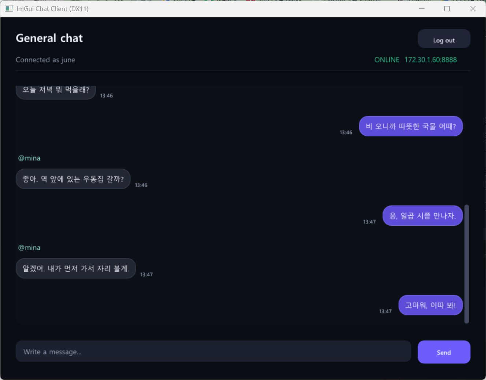
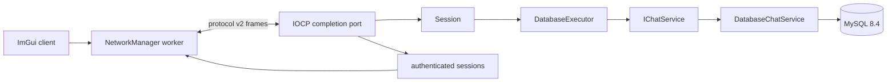
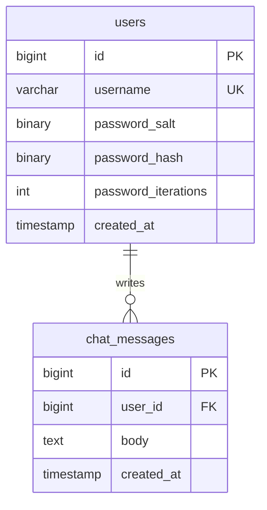

# Chatting Server Demo

Windows IOCP 채팅 서버와 Direct3D 11 ImGui 클라이언트를 함께 구현한 개인 프로젝트입니다. 길이가 있는 binary frame, 비동기 socket 처리, MySQL 영속화와 채팅 timeline을 한 서비스 흐름으로 연결합니다.



위 화면은 현재 Release client를 실제 MySQL과 IOCP server에 연결해 찍었습니다. 로그인 화면 대신 내 메시지와 상대 메시지, timestamp, history 복원이라는 서비스 핵심 결과만 남겼습니다.

## 핵심 흐름



클라이언트 UI는 socket을 직접 다루지 않습니다. `NetworkManager`가 연결, frame 송수신과 재연결을 맡고 UI에는 bounded event queue만 전달합니다. 서버는 접속마다 thread를 만들지 않고 completion port의 worker가 Accept, Receive, Send 완료를 처리합니다.

클래스 소유 관계, packet 처리 순서와 shutdown 경계는 [아키텍처 문서](docs/architecture.md)에 정리했습니다.

## 문제 해결 과정

각 사례는 문제와 원인, 선택과 구현, 검증과 한계 순서로 정리했습니다.

### recv 단위에 기대던 text packet을 frame으로 분리

초기 protocol은 packet type, sender, message를 공백으로 이어 보냈고, 수신부는 `std::istringstream`으로 이를 다시 나눴습니다. 당시 `recv`로 받은 바이트를 한 packet으로 다뤘기 때문에 TCP가 message 경계를 보장하지 않는다는 조건이 빠져 있었습니다.

하나의 message가 두 번의 수신으로 나뉘면 어느 지점까지 보관할지, 두 message가 함께 오면 어디서 나눌지가 정해지지 않았습니다. 채팅 본문은 공백 뒤 `getline`으로 복원했지만, 이것만으로 split과 coalesced frame을 구별할 수는 없었습니다.

이를 version, type, request ID, payload length를 담은 12바이트 header와 length-prefixed field로 바꿨습니다. `StreamingDecoder`는 미완성 frame을 buffer에 남기고, 완성된 frame이 여러 개면 도착 순서대로 꺼냅니다.

length가 64 KiB를 넘거나 version과 type이 맞지 않으면 decoder를 terminal error로 멈추게 했습니다. payload shape와 UTF-8도 함께 검사해 손상된 stream을 계속 해석하지 않습니다. protocol test는 byte 단위 split, coalesced frame, oversized length, malformed field와 invalid UTF-8을 확인합니다.

### detached thread와 공유 DB를 실행 경계로 나누기

초기 server는 접속마다 `std::thread`를 만들고 detach했으며, client loop가 singleton database manager와 연결 목록을 함께 사용했습니다. 이 구조에서는 종료할 때 남은 작업을 기다릴 기준과 한 connection을 누가 쓰는지가 분명하지 않았습니다.

server는 completion port worker가 Accept, Receive, Send 완료를 회수하도록 바꿨습니다. `Session`은 receive를 하나만 pending으로 두고, send는 mutex로 보호한 queue와 in-flight frame으로 직렬화합니다. partial send 뒤에도 다음 frame이 앞서 나가지 않습니다.

ODBC query는 IOCP worker가 직접 실행하지 않습니다. 단일 `DatabaseExecutor`가 하나의 service connection을 순서대로 사용하고, 기본 2,048개 queue가 차면 요청을 거절합니다. 느린 database가 network worker를 멈추거나 job을 무한히 쌓지 않게 한 선택입니다.

shutdown에서는 새 accept와 database 제출을 먼저 막고 session을 닫습니다. I/O operation의 생성과 retire 수가 모두 빠질 때까지 기다리며, executor도 accepting 상태와 실행 중 job 수를 분리해 종료를 확인합니다.

Release 검증에서 IOCP test는 14개 scenario, persistence unit test는 7개 묶음을 통과했습니다. 다만 오래 실행한 process의 ODBC 연결이 끊긴 뒤 자동 reconnect하는 경로는 아직 검증하지 않았습니다.

## 구현한 기능

### 길이가 있는 streaming protocol

protocol version 2 frame은 version, message type, request ID와 payload length를 12바이트 header에 담습니다. payload는 최대 64 KiB이고 UTF-8과 field 개수를 검증합니다.

`StreamingDecoder`는 TCP 수신이 frame 중간에서 끊기거나 여러 frame이 한 번에 도착해도 내부 buffer에서 완성된 message만 꺼냅니다. 한 번의 `recv`가 message 하나라는 가정은 제거했습니다.

### IOCP와 backpressure

서버는 기본 16개의 AcceptEx를 미리 걸고 completion port worker가 I/O 완료를 회수합니다. `Session`은 receive 하나만 진행되게 막고 send frame을 순서대로 직렬화합니다.

session send byte, database job, client outbound command와 inbound event는 모두 상한이 있습니다. 상한을 넘으면 연결이나 요청을 조용히 쌓아두지 않고 overflow 상태로 종료하거나 화면에 알립니다.

### 인증과 채팅 저장

가입 비밀번호는 16바이트 임의 salt와 PBKDF2-HMAC-SHA256 600,000회 결과로 저장합니다. 로그인할 때 hash를 다시 계산해 비교하며 사용자를 찾지 못해도 dummy verify를 수행합니다.

로그인 성공 뒤 최근 채팅 최대 50개를 오래된 순서로 보냅니다. 새 메시지는 MySQL에 저장된 뒤 인증된 session에 `ChatDelivered`로 전달되며 작성자, 본문과 UTC Unix millisecond를 포함합니다.

### 채팅 timeline

클라이언트는 수신한 UTC timestamp를 로컬 날짜와 `HH:mm`으로 바꿉니다. 날짜가 바뀌는 지점에는 separator를 넣고 내 메시지와 다른 사용자의 메시지를 서로 다른 bubble 정렬로 표시합니다.

발신 메시지도 서버가 돌려준 `ChatDelivered`를 기준으로 화면에 추가하므로 저장 결과와 화면 기록이 같은 순서를 사용합니다.

## 준비 사항

- Windows x64
- Visual Studio 2022 C++ 데스크톱 빌드 도구와 MSVC v143
- Docker Desktop 또는 호환 Docker Engine과 Docker Compose
- x64 MySQL Connector/ODBC Unicode 드라이버

서버는 `SQLDriversW`로 설치된 MySQL Unicode driver를 찾습니다. 여러 버전이 있으면 가장 높은 버전을 선택하고, `CHAT_DB_DRIVER`가 있으면 해당 이름만 사용합니다.

## 빌드와 실행

```powershell
Set-ExecutionPolicy -Scope Process Bypass
.\scripts\Package-Release.ps1
.\scripts\Start-ChatService.ps1 -Port 8888
```

처음 시작할 때 `.env.local`이 없으면 script가 강한 임의 MySQL 자격 증명을 만듭니다. 이 파일과 실행 PID는 Git과 Release ZIP에서 제외됩니다.

MySQL은 `127.0.0.1:3307`에만 공개되고 데이터는 Docker named volume에 남습니다. 클라이언트는 저장소에서 `Client\x64\Release\Client.exe`, package에서 `bin\Client.exe`입니다.

```powershell
.\scripts\Stop-ChatService.ps1
```

중지 script는 기록된 PID가 실제 `Server.exe`인지 확인하고 정상 종료를 기다린 뒤 `docker compose down`을 실행합니다. named volume은 삭제하지 않습니다.

## LAN 실행

기본 bind 주소는 `127.0.0.1`입니다. 같은 LAN의 다른 PC에서 접속할 때만 호스트의 실제 IPv4를 지정합니다.

```powershell
.\scripts\Start-ChatService.ps1 -BindAddress 192.168.0.10 -Port 8888
```

`0.0.0.0`도 명시적으로 선택할 수 있지만 모든 IPv4 interface에서 수신합니다. script는 방화벽이나 router 설정을 바꾸지 않으므로 다른 장치에서 TCP 8888에 접근 가능한지는 사용자가 별도로 확인해야 합니다.

같은 PC에서 LAN 주소로 접속하는 검사는 loopback이 아닌 bind 경로를 확인할 뿐 별도 장치 E2E는 아닙니다.

## 직접 실행 환경 변수

```text
CHAT_DB_HOST=127.0.0.1
CHAT_DB_PORT=3307
CHAT_DB_NAME=chatdb
CHAT_DB_USER=chatapp
CHAT_DB_PASSWORD=...
CHAT_DB_DRIVER=registered Unicode driver name
CHAT_SERVER_PORT=8888
CHAT_SERVER_BIND_ADDRESS=127.0.0.1
```

명령줄의 `--port`와 `--bind-address`가 환경 변수보다 우선합니다. 서버는 연결 문자열과 비밀번호를 log에 출력하지 않고, 읽은 DB 비밀번호는 process environment에서 지웁니다.

## 데이터 모델

`Server\Database\schema.sql`은 MySQL 8.4, InnoDB와 utf8mb4 전용입니다.



## 테스트

다음 x64 test project를 Debug와 Release에서 빌드하고 실행합니다.

- `tests\ChatProtocolTests.vcxproj`
- `tests\IocpServerTests.vcxproj`
- `tests\ChatPersistenceUnitTests.vcxproj`

protocol test에는 client network integration도 포함됩니다. script contract test는 package와 start 및 stop script가 secret, PID, bind와 종료 계약을 지키는지 검사합니다.

실제 MySQL 초기화, 재시작 뒤 기록 복원과 장애 복구는 Docker Engine과 x64 Unicode ODBC driver가 준비된 환경에서만 검증할 수 있습니다. 단위 테스트 결과를 MySQL 통합 성공으로 바꾸어 쓰지 않습니다.

실행한 검증과 남은 환경 경계는 [검증 기록](docs/verification.md)에 남깁니다.

## Release ZIP

`scripts\Package-Release.ps1`은 Server와 Client 실행 파일, lifecycle script, Compose 파일, schema, README와 `.env.example`만 `dist\ChatService-x64-Release.zip`에 넣습니다.

ODBC installer, `.env.local`, PDB, ILK와 Docker volume 데이터는 package에 포함하지 않습니다.

## 코드 지도

| 경로 | 역할 |
| --- | --- |
| `Common/Protocol` | versioned frame codec와 streaming decoder |
| `Client/Network` | worker thread, bounded queue, 연결과 송수신 |
| `Client/UI/Application.*` | 로그인, 가입, 채팅 화면과 Direct3D frame loop |
| `Client/UI/ClientPacketReducer.*` | server packet을 login과 timeline 상태로 축약 |
| `Client/UI/ChatTimeline.*` | UTC timestamp의 날짜와 시각 표현 |
| `Server/Core/Server.*` | IOCP, AcceptEx, worker와 session registry |
| `Server/Network/Session.*` | 인증 상태, streaming decode와 serialized send |
| `Server/Application` | 입력 검증, database job queue와 service interface |
| `Server/Database` | Unicode ODBC driver 선택과 MySQL query |
| `Server/Security` | PBKDF2 password hash와 verify |
| `scripts/` | package, start, stop과 lifecycle 공통 함수 |
| `tests/` | codec, IOCP, client network, persistence와 script contract |

## 범위

이 프로젝트는 한 명이 구현한 Windows LAN 채팅 service입니다. TLS, internet 공개, 여러 채팅방, 첨부 파일, 관리자 기능은 현재 범위에 포함하지 않습니다.

장시간 실행 중 ODBC 연결이 끊긴 뒤 자동으로 다시 연결하는 경로도 아직 검증되지 않았습니다. 새 Server process가 같은 DB에 연결하는 복구는 확인했지만 process 내부 reconnect를 완료된 기능으로 표시하지 않습니다.
