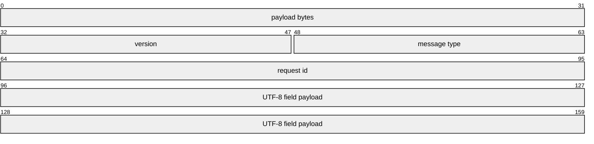
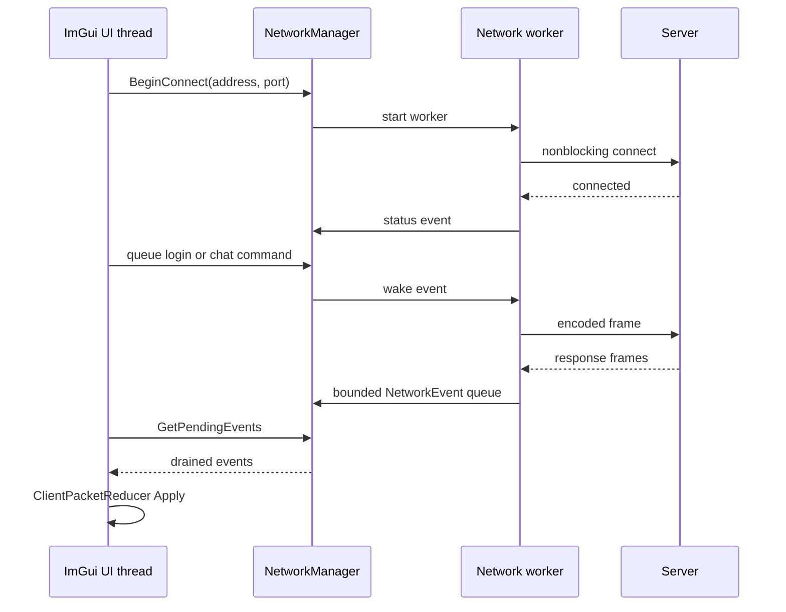
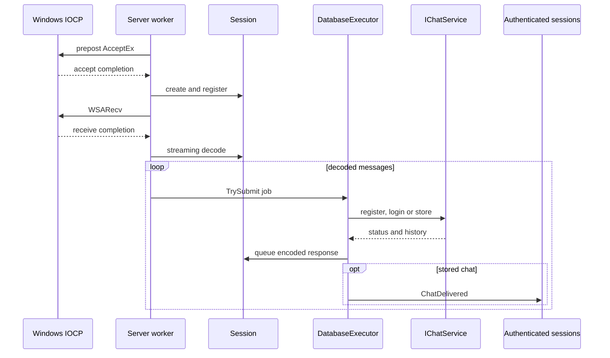
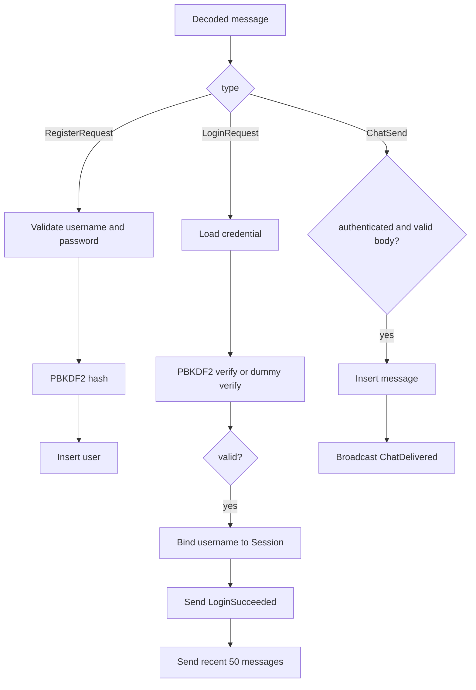
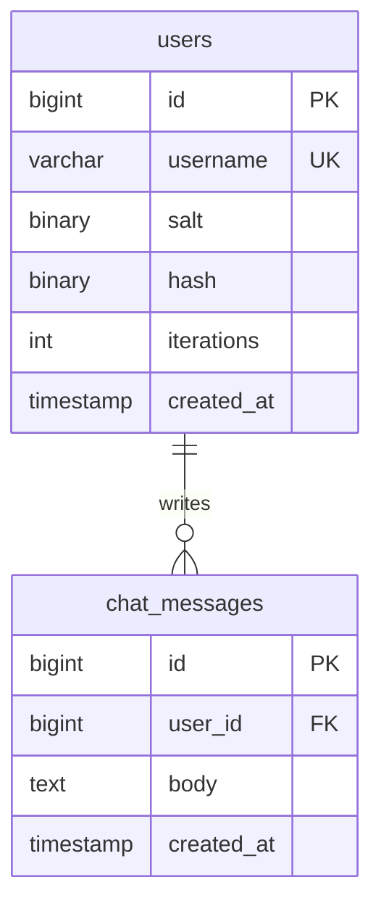

# 아키텍처

채팅 화면, 소켓 통신, IOCP 서버와 DB 저장을 서로 분리했습니다. 화면 스레드는 렌더링만 맡고, 네트워크와 DB 대기는 각각 별도 스레드에서 처리합니다. 작업이 갑자기 몰려도 메모리가 계속 늘지 않도록 큐마다 최대 크기를 정했습니다.

## 클래스 관계

클라이언트와 서버는 같은 `ChatProtocol` 코덱을 사용합니다. 화면은 패킷을 직접 보관하지 않고, `ClientPacketReducer`가 로그인 상태와 채팅 목록으로 바꾼 결과만 사용합니다.

## 패킷 형식

헤더는 12바이트이며 버전, 메시지 종류, 요청 번호와 본문 길이를 담습니다. 본문은 길이를 앞에 붙인 필드 목록이고 전체 크기는 64 KiB 이하입니다. 코덱은 버전과 메시지 종류, UTF-8 형식, 필드 개수와 길이를 확인합니다.

`StreamingDecoder`는 아직 다 받지 못한 패킷을 버퍼에 남겨 다음 수신 데이터와 이어 붙입니다. 패킷 여러 개가 한 번에 들어오면 길이만큼 차례로 꺼냅니다. 잘못된 패킷을 발견하면 연결을 닫아 손상된 데이터를 계속 해석하지 않습니다.

## 클라이언트 통신

보낼 명령은 128개, 화면으로 전달할 이벤트는 256개까지 쌓을 수 있습니다. `NetworkManager`의 작업 스레드가 소켓을 기다리므로 화면은 멈추지 않습니다.

요청 번호는 자신이 보낸 채팅을 구분해 말풍선 위치를 정할 때 사용합니다. 한 패킷이 나눠 전송되더라도 보낸 위치를 기억하고 다음 패킷과 순서가 바뀌지 않게 처리합니다.

## IOCP server

서버는 `AcceptEx` 요청 16개를 미리 걸어 둡니다. 연결된 소켓은 completion port에 등록하고, 각 `Session`이 수신 상태와 로그인 사용자, 전송 큐를 관리합니다.

서버를 종료할 때는 새 연결과 DB 작업부터 막습니다. 그다음 세션을 닫고 이미 시작한 I/O가 모두 끝난 뒤 작업 스레드를 정리합니다.

## DB 작업

IOCP 작업 스레드는 ODBC 쿼리를 직접 실행하지 않습니다. `DatabaseExecutor`의 단일 작업 스레드가 가입, 로그인과 메시지 저장을 순서대로 처리합니다. 덕분에 하나의 DB 연결을 여러 스레드가 동시에 건드리지 않습니다.

DB 작업 큐는 최대 2,048개입니다. 큐가 가득 차면 해당 연결을 닫아 더 많은 작업이 쌓이지 않게 합니다. DB가 느려져도 IOCP 작업 스레드는 다른 소켓 처리를 이어 갑니다.

서버는 `IChatService`만 바라봅니다. 테스트에서는 MySQL 대신 메모리 구현을 넣어 가입, 로그인, 이전 대화와 채팅 전달을 빠르게 확인합니다.

## 인증과 메시지 처리

로그인한 사용자는 `Session`에 저장합니다. 채팅 패킷에는 닉네임을 받지 않고, 서버가 소켓에 연결된 사용자를 발신자로 정합니다.

없는 닉네임으로 로그인해도 PBKDF2 검증을 한 번 수행합니다. 닉네임이 있는 경우와 없는 경우의 처리 시간 차이를 줄이기 위해서입니다.

## 데이터 모델과 시간

MySQL의 저장 시각은 UTC Unix millisecond로 패킷에 넣습니다. 클라이언트의 `ChatTimeline`이 이를 현재 지역의 날짜와 `HH:mm`으로 바꿉니다. 서버가 보낸 순서는 그대로 유지합니다.

## 서비스 실행과 종료

`Start-ChatService.ps1`은 로컬 비밀번호 생성, Compose 시작, MySQL 상태 확인과 서버 실행을 순서대로 진행합니다. 서버가 시작 직후 종료되지 않았는지 확인하고 주소와 PID를 `.run/server.json`에 기록합니다.

`Stop-ChatService.ps1`은 PID와 실행 파일 경로를 함께 확인한 뒤 종료 신호를 보냅니다. 서버가 끝나면 Compose를 내리되 MySQL 데이터 볼륨은 남깁니다.

콘솔 종료 신호와 스크립트의 종료 신호는 모두 `RequestStop`으로 모입니다.

## UI와 렌더링

`Application`은 로그인 전에는 작은 로그인 카드를, 로그인 후에는 전체 채팅 화면을 그립니다. 채팅 화면에는 접속 주소, 현재 사용자, 날짜, 시간과 좌우 말풍선이 표시됩니다.

비밀번호 버퍼는 요청을 큐에 넣은 직후와 종료할 때 `SecureZeroMemory`로 지웁니다. 회원가입 입력은 화면에서 먼저 검사하고 서버에서 다시 확인합니다.

창 크기가 바뀌면 `WM_SIZE`에서 새 너비와 높이를 저장합니다. 다음 프레임을 시작하기 전에 `D3D11Manager`가 DXGI 백 버퍼와 렌더 타깃을 다시 만들어 빈 여백 없이 화면을 채웁니다.

## 확인한 항목

- 코덱 테스트: 분할 수신, 여러 패킷 동시 수신, 잘못된 패킷과 UTF-8
- 클라이언트 통합 테스트: 연결, 분할 전송, 큐, 재접속과 작업 스레드 종료
- IOCP 테스트: 미리 건 AcceptEx, 세션 수명, 큐 한도와 서버 종료
- 저장 테스트: 계정, 비밀번호 해시, 메시지와 이전 대화
- 스크립트 테스트: 로컬 비밀번호, 주소, PID, 패키지와 종료 순서
- 실제 실행: MySQL 가입과 로그인, 양방향 채팅, 재시작 뒤 대화 복원
