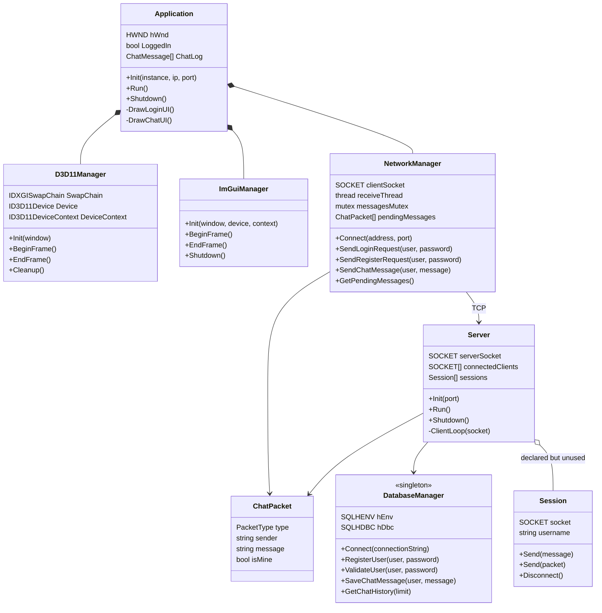
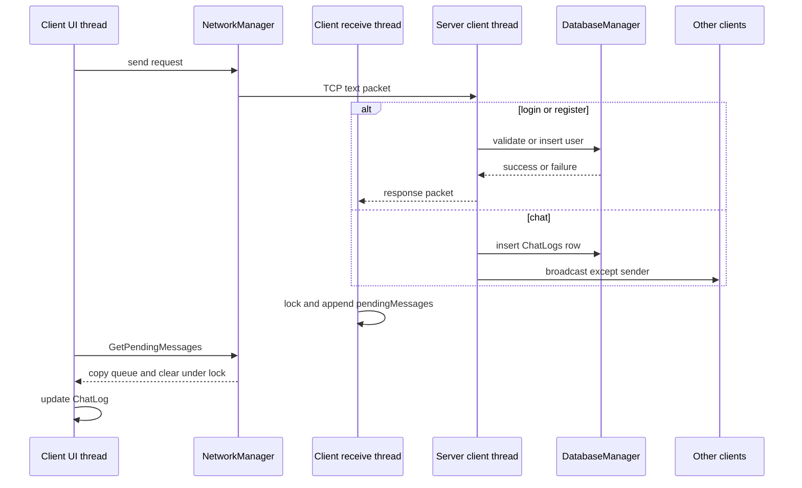
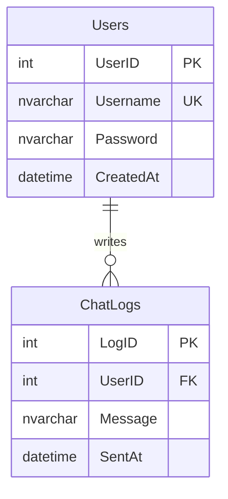
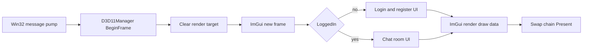

# 아키텍처

ChattingServerDemo는 한 프로세스 안에 모든 기능을 넣지 않고 GUI 클라이언트, TCP 서버, SQL Server로 역할을 나눴습니다. 클라이언트 안에서도 화면 스레드와 수신 스레드가 분리됩니다.

## 클래스 관계

`Application`은 세 객체를 값 멤버로 소유합니다. 초기화 순서는 Direct3D, ImGui, TCP 연결이며 종료는 TCP, ImGui, Direct3D 순서입니다. 네트워크 연결에 실패하면 메시지 상자를 띄운 뒤 초기화가 실패합니다.

서버는 `accept` 결과마다 `ClientLoop` 스레드를 분리합니다. `Session` 벡터도 멤버로 선언돼 있지만 실제로는 원시 `SOCKET`만 `connectedClients`에 넣고 `Session` 객체를 만들지 않습니다.

## 스레드와 데이터 이동

클라이언트의 공유 경계는 비교적 분명합니다. 수신 스레드는 `pendingMessages`만 쓰고 UI 스레드는 `GetPendingMessages`로 복사한 뒤 화면 상태를 갱신합니다. 두 접근은 같은 mutex를 사용합니다.

서버 쪽은 다릅니다. 여러 분리 스레드가 `connectedClients`를 추가, 순회, 삭제하지만 mutex가 없습니다. 하나의 `DatabaseManager` 연결도 모든 스레드가 공유합니다. 다중 클라이언트 부하를 받기 전에 소유권과 동기화 정책이 필요합니다.

## 패킷 형식

전송 형식은 바이너리 구조체가 아니라 공백으로 구분한 문자열입니다.

| 종류 | 값 | 전송 예시 | 서버 동작 |
| --- | ---: | --- | --- |
| LOGIN | 0 | `0 alice password` | 사용자와 비밀번호 조회 |
| REGISTER | 1 | `1 alice password` | 사용자 행 삽입 |
| CHAT | 2 | `2 alice hello world` | 채팅 저장 후 브로드캐스트 |
| LOGIN_SUCCESS | 3 | `3` | 클라이언트 로그인 상태 변경 |
| LOGIN_FAILED | 4 | `4` | 실패 팝업 표시 |
| REGISTER_SUCCESS | 5 | `5` | 현재 클라이언트에서는 로그인 성공과 같은 문구 처리 |
| REGISTER_FAILED | 6 | `6` | 실패 팝업 표시 |

`send` 호출 한 번과 `recv` 호출 한 번이 일대일로 대응한다는 보장은 TCP에 없습니다. 길이 접두사, 줄 구분자, 누적 버퍼 중 하나가 없어서 패킷이 나뉘거나 여러 개가 합쳐지면 파싱이 깨질 수 있습니다.

## 데이터 모델

`DatabaseManager`는 ODBC 환경 핸들과 연결 핸들을 싱글턴으로 보유합니다. SQL 문은 파라미터 바인딩을 사용해 값 자체를 문자열로 이어 붙이지 않습니다. 다만 비밀번호 해시와 salt가 없고 연결 문자열도 코드에 고정돼 있습니다.

`GetChatHistory`는 사용자 이름과 메시지를 최근 순으로 조회하지만 이를 호출하는 서버 패킷은 없습니다. 스키마와 데이터 접근 함수까지만 있고 기능 흐름에는 연결되지 않은 상태입니다.

## 렌더링 경로

`D3D11Manager`는 900 x 700 Win32 창에 맞춘 스왑 체인과 렌더 타깃을 만듭니다. `ImGuiManager`는 Win32 입력 백엔드와 Direct3D 11 렌더링 백엔드를 연결합니다. 실제 로그인과 채팅 화면은 `Application`이 구성합니다.

## 개선 우선순위

1. 비밀번호를 해시하고 TLS 또는 별도 보안 채널을 적용합니다.
2. 길이 접두사와 누적 수신 버퍼로 TCP 프레이밍을 만듭니다.
3. 서버의 연결 레지스트리와 DB 접근을 동기화하거나 작업 큐로 직렬화합니다.
4. 로그인 비밀번호 입력과 발신 메시지 로컬 반영을 완성합니다.
5. 사용하지 않는 `Session`을 실제 연결 소유자로 통합하거나 제거합니다.
6. DB가 없어도 프로토콜을 검증할 수 있는 테스트 대역과 자동화된 테스트를 추가합니다.
