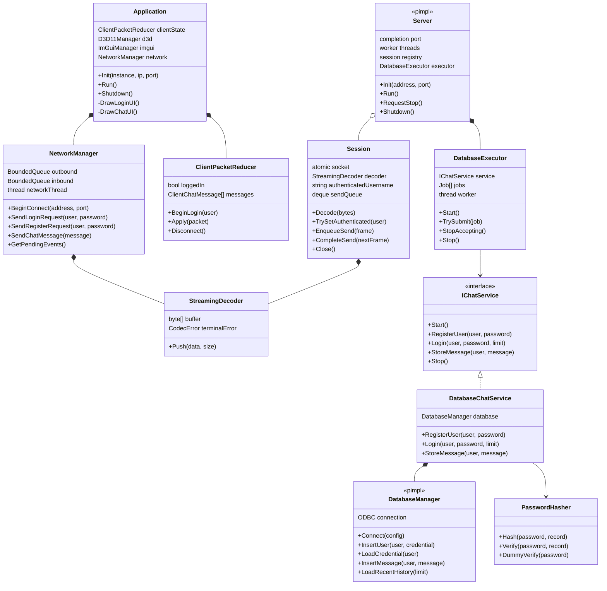
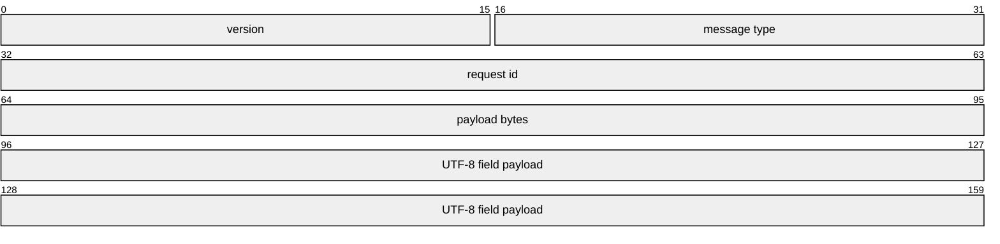
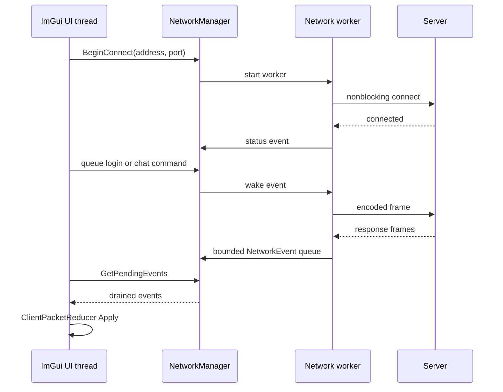
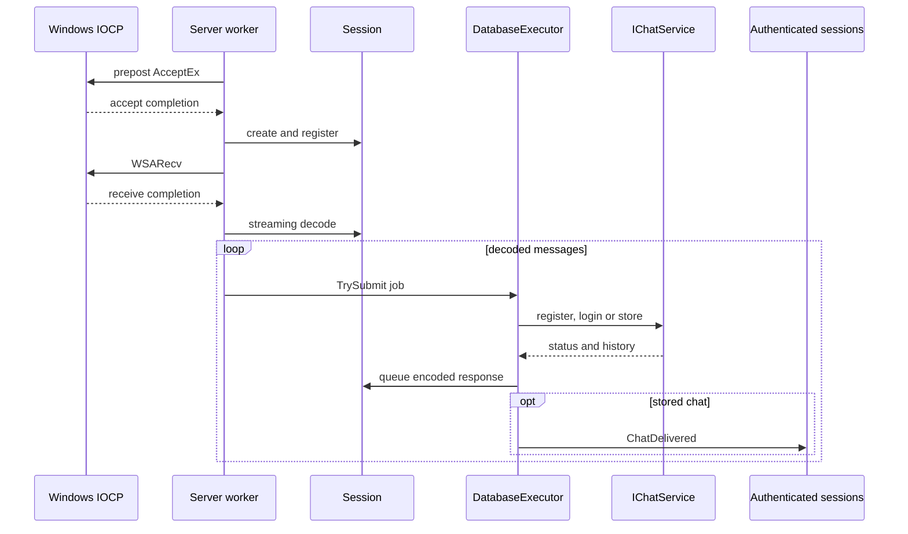
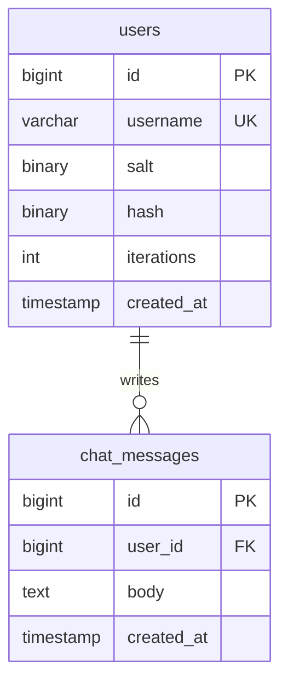

# 아키텍처

Chatting Server Demo는 GUI, client network worker, binary protocol, IOCP transport와 database service를 분리합니다. 각 경계는 bounded queue나 interface를 통해 연결해 느린 client와 database가 무제한 memory 증가로 이어지지 않게 합니다.

## 클래스 관계

Client와 Server는 같은 `ChatProtocol` codec을 사용합니다. UI model은 protocol message를 직접 보관하지 않고 `ClientPacketReducer`에서 로그인 상태와 채팅 항목으로 축약합니다.

## protocol frame

header는 network byte order의 12바이트입니다. payload는 length-prefixed field 목록이며 전체 크기는 64 KiB 이하입니다. codec은 version, message type, UTF-8, field 개수와 길이를 모두 검증합니다.

`StreamingDecoder`는 incomplete frame을 buffer에 남깁니다. 완성된 frame이 여러 개 있으면 한 번에 반환합니다. terminal protocol error가 생긴 decoder는 이후 입력도 같은 error로 거절해 손상된 stream을 계속 해석하지 않습니다.

## client 경계

outbound command는 128개, inbound event는 256개로 제한됩니다. network worker는 UI thread를 막지 않고 stop event와 wake event로 종료와 새 command를 기다립니다.

request ID는 login과 register 응답을 보낸 요청에 연결합니다. send queue는 partial send offset을 유지하고 frame 순서를 바꾸지 않습니다.

## IOCP server

Server는 기본 16개 AcceptEx를 유지합니다. accept된 socket은 completion port에 연결되고 `Session`이 receive pending, 인증 사용자와 send queue를 소유합니다.

I/O operation은 생성과 retire 수를 diagnostic으로 셉니다. shutdown은 새 accept와 database 제출을 막고 session을 닫은 뒤 outstanding operation이 모두 빠져나올 때까지 기다립니다.

## database 직렬화

IOCP worker는 ODBC query를 직접 실행하지 않습니다. `DatabaseExecutor`의 단일 worker가 `IChatService` job을 순서대로 실행해 하나의 connection 소유권을 명확하게 유지합니다.

database queue 기본 상한은 2,048개입니다. 가득 차면 해당 request를 실패시키고 diagnostic counter를 올립니다. network worker가 database 지연 때문에 block되지 않습니다.

`IChatService` 덕분에 IOCP와 protocol test는 실제 MySQL 없이 memory service로 register, login, history와 chat 처리를 검증할 수 있습니다.

## 인증과 메시지 처리

```mermaid
flowchart TD
    A[Decoded message] --> B{type}
    B -->|RegisterRequest| C[Validate username and password]
    C --> D[PBKDF2 hash]
    D --> E[Insert user]
    B -->|LoginRequest| F[Load credential]
    F --> G[PBKDF2 verify or dummy verify]
    G --> H{valid?}
    H -->|yes| I[Bind username to Session]
    I --> J[Send LoginSucceeded]
    J --> K[Send recent 50 messages]
    B -->|ChatSend| L{authenticated and valid body?}
    L -->|yes| M[Insert message]
    M --> N[Broadcast ChatDelivered]
```

`Session`에 인증 사용자가 저장되므로 ChatSend frame은 username을 받지 않습니다. server가 socket과 연결된 identity를 사용해 발신자를 결정합니다.

비밀번호를 찾지 못한 로그인도 PBKDF2 dummy verify를 수행합니다. 사용자 존재 여부에 따른 계산량 차이를 줄이기 위한 경계입니다.

## 데이터 모델과 시간

MySQL은 timestamp를 UTC Unix millisecond로 변환해 protocol에 넣습니다. client의 `ChatTimeline`이 local calendar date와 `HH:mm`을 계산합니다. 날짜 separator와 message clock은 server 순서를 다시 정렬하지 않고 받은 timeline을 표현합니다.

## service lifecycle

`Start-ChatService.ps1`은 secret 생성, Compose 시작, health check, server process 시작과 실제 bind 확인을 순서대로 수행합니다. 성공한 endpoint와 PID를 `.run/server.json`에 기록합니다.

`Stop-ChatService.ps1`은 PID뿐 아니라 executable path를 확인합니다. named event로 정상 종료를 요청하고 process가 끝난 뒤 Compose를 내립니다. 데이터 volume은 유지합니다.

Server 자체도 console control event와 선택적인 named stop event를 같은 `RequestStop` 경계로 모읍니다.

## UI와 렌더링

`Application`은 login card와 full-window chat room을 상태에 따라 그립니다. chat 화면에는 접속 endpoint, 현재 사용자, 날짜 separator, 시간과 좌우 message bubble이 있습니다.

password buffer는 request queue에 들어간 직후와 shutdown 때 `SecureZeroMemory`로 지웁니다. UI는 register 입력 길이와 공백을 server와 같은 규칙으로 먼저 검사하지만 server validation이 최종 기준입니다.

## 검증 경계

- codec test는 split, coalesced, malformed frame과 UTF-8을 검사합니다.
- client network integration은 connect, partial send, queue, reconnect와 worker 종료를 검사합니다.
- IOCP test는 preposted accept, session 수명, backpressure, database queue와 shutdown을 검사합니다.
- persistence unit test는 service와 database mapping, password hash와 ODBC Unicode 변환을 검사합니다.
- script contract test는 secret, bind, PID, package와 stop 정책을 검사합니다.
- live E2E는 실제 MySQL과 server process에서 가입, 로그인, 양방향 chat, 재시작 뒤 history, offline reconnect를 검사합니다.

단위 및 process-local 통합 테스트는 별도 LAN 장치와 실제 router 경계를 검증하지 않습니다.
