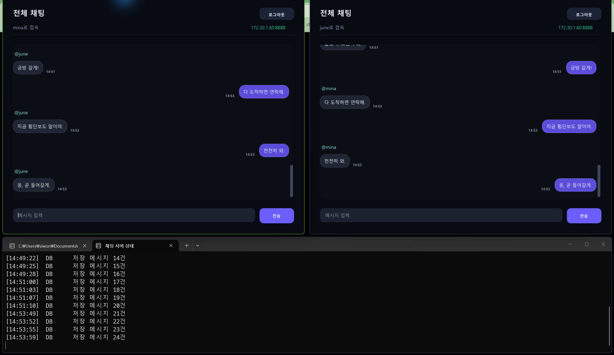

# 검증 기록

마지막 확인일은 2026년 9월 4일입니다. Windows에서 Visual Studio 2022와 MySQL 8.4 컨테이너를 사용했습니다.

## 빌드와 자동 테스트

Client, Server, 프로토콜 테스트와 저장 테스트를 Debug와 Release로 각각 빌드했습니다.

| 대상 | Debug | Release |
| --- | --- | --- |
| Client | 통과 | 통과 |
| Server | 통과 | 통과 |
| ChatProtocolTests | 통과 | 통과 |
| IocpServerTests | 통과 | 통과 |
| ChatPersistenceUnitTests | 통과 | 통과 |

```powershell
.\tests\x64\Debug\ChatProtocolTests.exe
.\tests\x64\Release\ChatProtocolTests.exe
.\tests\x64\Debug\IocpServerTests.exe
.\tests\x64\Release\IocpServerTests.exe
.\tests\x64\Debug\ChatPersistenceUnitTests.exe
.\tests\x64\Release\ChatPersistenceUnitTests.exe
pwsh -File .\tests\ScriptsContractTests.ps1
```

IOCP 테스트는 클라이언트 100개 동시 접속, 분할 수신, 여러 패킷 동시 수신, 전송 순서와 종료 처리를 확인합니다. 저장 테스트는 계정 생성, 로그인, 메시지 저장과 최근 기록 복원을 확인합니다.

## 실제 MySQL 연결

서버를 `127.0.0.1:8890`에 띄우고 다음 순서로 실행했습니다.

1. 계정 두 개를 만들고 로그인했습니다.
2. 양쪽에서 메시지를 보낸 뒤 MySQL 저장 내용을 확인했습니다.
3. 서버를 다시 시작하고 저장된 대화가 복원되는지 확인했습니다.
4. 서버가 꺼진 주소에 다시 접속했을 때 클라이언트 작업 스레드가 끝나는지 확인했습니다.

모든 단계가 종료 코드 0으로 끝났습니다.

## LAN 시연

서버를 Wi-Fi LAN 주소 `172.30.1.60:8888`에 열고 Release 클라이언트 두 개로 접속했습니다. `mina`와 `june`이 같은 대화를 보고, 메시지를 보낼 때마다 MySQL 저장 건수가 20건에서 24건으로 늘어나는 과정을 한 번에 녹화했습니다.

[](assets/chat-service-demo.mp4)

[18초 시연 영상 보기](assets/chat-service-demo.mp4)

가까이 본 채팅 화면은 [chat-timeline.png](assets/chat-timeline.png)에서 확인할 수 있습니다. Docker 컨테이너에서도 같은 LAN 주소로 TCP 연결을 확인했습니다.

## Release 패키지

```powershell
pwsh -File .\scripts\Package-Release.ps1
```

명령이 끝나면 실행 파일, 실행 스크립트와 이 문서를 담은 `dist\ChatService-x64-Release.zip`이 생성됩니다.
